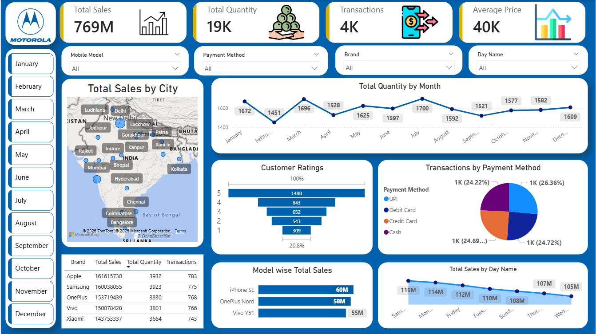

# 📊 Mobile Sales Dashboard (Power BI)

## 🚀 Project Overview
This project showcases an interactive **Power BI Dashboard** built to analyze mobile sales data across different dimensions such as cities, brands, models, and time.

The dashboard helps in understanding key business metrics like total sales, quantity sold, transactions, and customer behavior through visually appealing and insightful reports.

---

## 📷 Dashboard Preview

---

## 📌 Key Features

- 📈 **KPIs Overview**
  - Total Sales: 769M
  - Total Quantity: 19K
  - Transactions: 4K
  - Average Price: 40K

- 🌍 **Geographical Analysis**
  - Sales distribution across major cities in India

- 📅 **Time-Based Insights**
  - Monthly trends in total quantity
  - Daily sales performance

- 📊 **Customer Insights**
  - Customer rating distribution

- 💳 **Transaction Analysis**
  - Payment method breakdown (UPI, Debit Card, Credit Card, Cash)

- 📱 **Product Analysis**
  - Model-wise and brand-wise sales performance

- 🎯 **Dynamic Filters**
  - Month selection
  - Mobile Model
  - Payment Method
  - Brand
  - Day Name

---

## 🛠️ Tools & Technologies

- **Power BI** – Data visualization & dashboard creation  
- **Excel / CSV** – Data source  
- **DAX** – Calculated measures and KPIs  
- **Power Query** – Data cleaning and transformation  

---

## 📊 Insights Derived

- Certain cities contribute significantly more to overall sales.
- Sales fluctuate across months with peaks in specific periods.
- UPI and card payments dominate transaction methods.
- Premium models generate higher revenue despite lower quantity.
- Customer ratings are skewed towards higher satisfaction levels.

---

## 📁 Project Structure
├── Mobile_Sales_Dashboard.pbix
├── Mobile_Sales_Dashboard_Snap.png
└── README.md

---

## ⚙️ How to Use

1. Download the `.pbix` file from this repository  
2. Open it using **Power BI Desktop**  
3. Interact with filters and visuals to explore insights  

---

## 🎯 Future Improvements

- Add forecasting for sales trends  
- Include profit and cost analysis  
- Integrate real-time data sources  
- Enhance UI/UX with advanced Power BI features  

---

## 👤 Author

**Kuldeep Jha**  
Data Analyst  

- 💼 Skills: SQL, Python, Power BI, Pandas, NumPy, Machine Learning, Excel  
- 📫 Connect on LinkedIn : www.linkedin.com/in/kuldeep-jha-b3517b316

---

## ⭐ Support

If you found this project useful, consider giving it a ⭐ to support!
